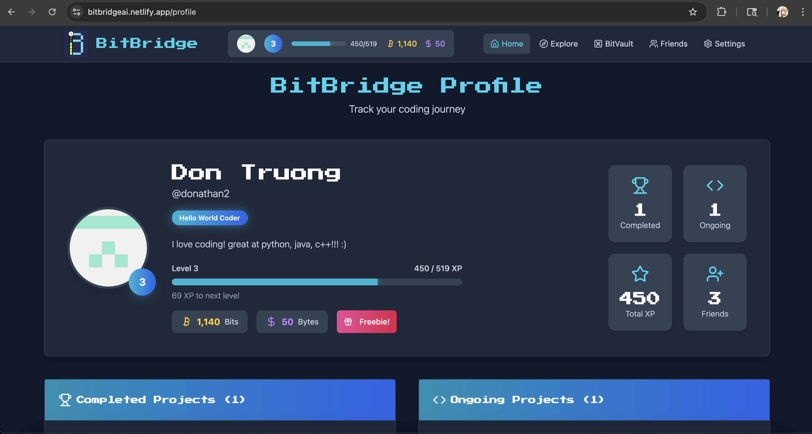

<h1 style="font-size: 18px;">BitBridge 🚀✨</h1> 

Connect through Code! Bitbridge is a web application that helps users find coding projects to work on and the supportive community to bolster their growth!

<a href = "bitbridgeai.netlify.app">🔗 Check Bitbridge out here! </a>

<h2>About Bitbridge 🧠</h2>

Bitbridge was built during the 2025 Startery x Antler launchpad series, aiming to bridge the gap between aspiring and thriving programmer! This application lets users create coding projects, join others projects, and work on them in a designated project area. Bitbridge is also gamified, allowing users to collect currency from completed projects and daily logins to incentivize consistent use. 

<h2>Functionality Features 🔧</h2>
<ul>
  <li> Robust project selection and joining interface</li>
  <li> Built-in GitHub integration</li>
  <li> Dynamic project workspace with communication functions for teams</li>
  <li> Interactive friend adding and messaging system</li>
  <li> Modular reward and currency system upon prokect completion</li>
  <li> Sleek profile customization choices through titles</li>
  <li> Secure user authentication options with Github or Google</li>
</ul>

<h2> Tech Stack 💻</h2>
<h3>Frontend</h3>
<ul>
  <li>Next.js/TypeScript</li>
  <li>Tailwind CSS</li>
  <li>React hooks</li>
  <li>Context API</li>
  </ul>
<h3>Backend</h3>
<ul>
  <li>Supabase</li>
  <li>OAuth providers: Google, Github</li>
</ul>
<h3>Deployment</h3>
<ul>
  <li>Netlify</li>
</ul>

